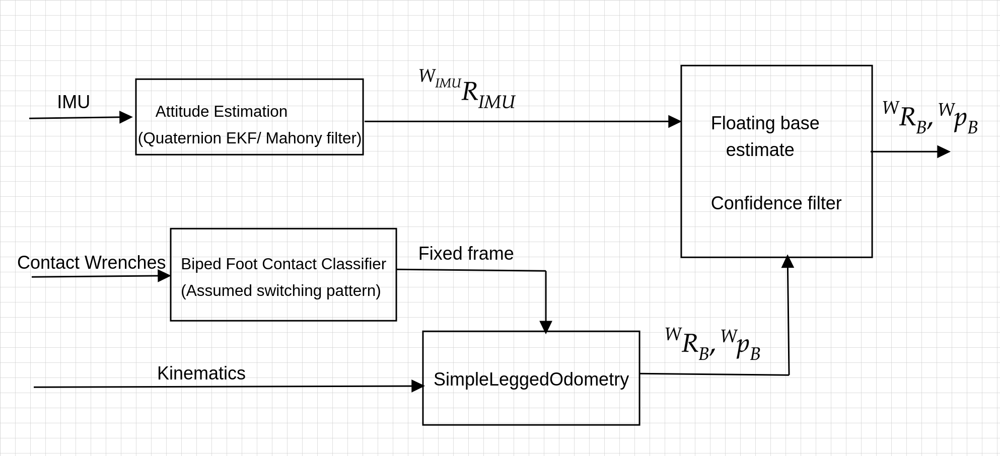

# whole-body-estimators
YARP-based estimators for humanoid robots.

# Overview
 - [:orange_book: Implementation](#orange_book-implementation)
 - [:page_facing_up: Dependencies](#page_facing_up-dependencies)
 - [:hammer: Build the suite](#hammer-build-the-suite)

# :orange_book: Implementation
The current implementations available in the `devices` folder include,
- `baseEstimatorV1` includes a simple humanoid floating base estimation algorithm fusing legged odometry and IMU attitude estimation, aimed to be used along side walking controllers.




# :page_facing_up: Dependencies
* [YARP](http://www.yarp.it/): to handle the comunication with the robot;
* [ICUB](https://github.com/robotology/icub-main): to use the utilities like low pass filters from the `ctrLib` library
* [iDynTree](https://github.com/robotology/idyntree/tree/devel): to setup the floating base estimation algorithm. Please compile iDynTree with CMake option IDYNTREE_USES_ICUB_MAIN ON (depends on ICUB).
* [Gazebo](http://gazebosim.org/): for the simulation (tested Gazebo 8 and 9).

  ## Optional Dependencies
  * [walking-controllers](https://github.com/robotology/walking-controllers): to test the floating base estimation along side walking controllers

It must be noted that all of these dependencies can be directly installed together in one place using the [robotology-superbuild](https://github.com/robotology/robotology-superbuild).


# :hammer: Build the suite
## Linux

```sh
git clone https://github.com/robotology/whole-body-estimators.git
cd whole-body-estimators
mkdir build && cd build
cmake ../
make
[sudo] make install
```
Notice: `sudo` is not necessary if you specify the `CMAKE_INSTALL_PREFIX`. In this case it is necessary to add in the `.bashrc` or `.bash_profile` the following lines:
``` sh
export WBDEstimator_INSTALL_DIR=/path/where/you/installed
export YARP_DATA_DIRS=${YARP_DATA_DIRS}:${WBDEstimator_INSTALL_DIR}/share/yarp:${WBDEstimator_INSTALL_DIR}/lib/yarp
```

# Using the estimators
- [`baseEstimatorV1`](devices/baseEstimatorV1/README.md) Please follow the documentation available here to run the floating base estimator.

# Authors
```
Hosameldin Awadalla Omer Mohamed <hosameldin.mohamed@iit.it>
Francisco Javier Andrade Chavez <FranciscoJavier.AndradeChavez@iit.it>
Prashanth Ramadoss <prashanth.ramadoss@iit.it>
Giulio Romualdi    <giulio.romualdi@iit.it>
Silvio Traversaro  <silvio.traversaro@iit.it>
Daniele Pucci      <daniele.pucci@iit.it>
```
